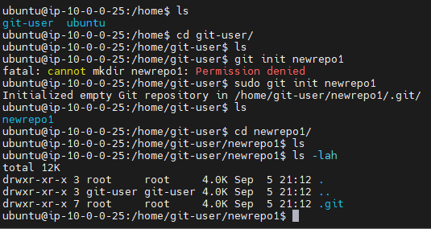
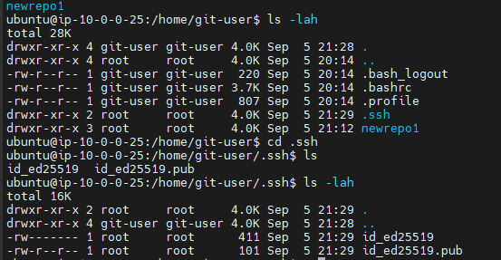

# My Project 1
#  Created User on AWS server named git-user,
# used init to create a git repo named newrepo1
# image displays user, group and other permissions

# added keys. to work with github into git-user

# clone is used to clone repositories from github to server or vise versa
# init is used to create a git repo on a server.
# git add is used to add changed files to be uploaded to your git repository
# git commit is used to commit the changes you just added in order to upload to your repository.
# git push is used to push those changes to your repository, this will "sync" your server side git repository to your repository stored on github.
