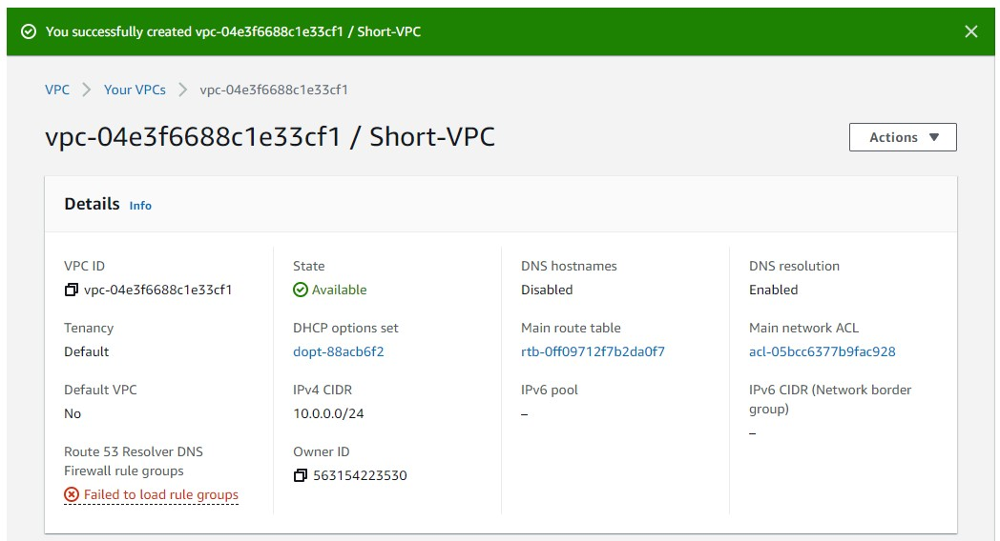
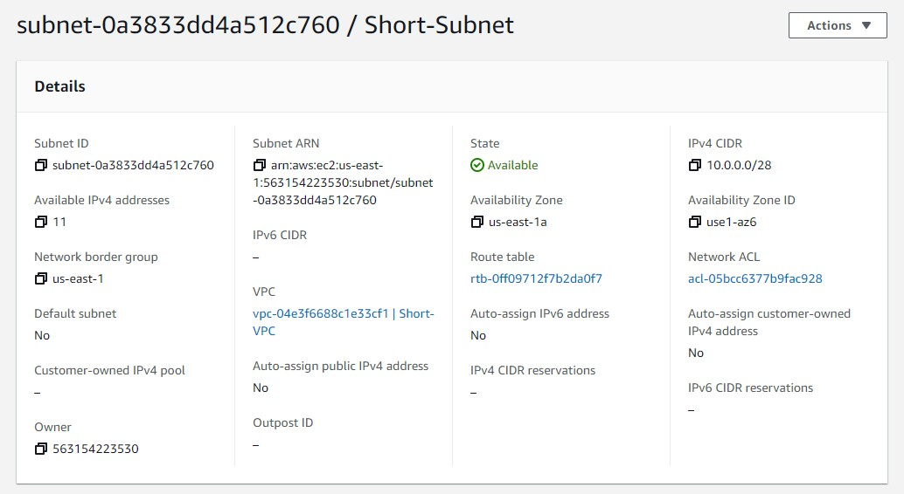
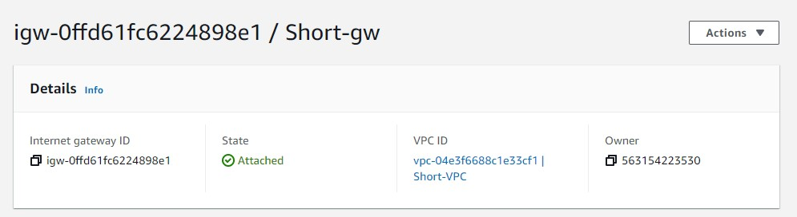
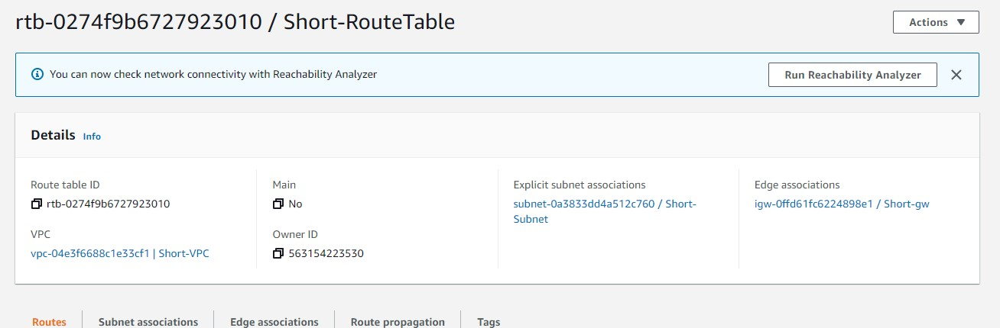
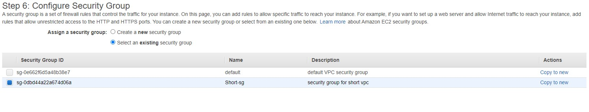
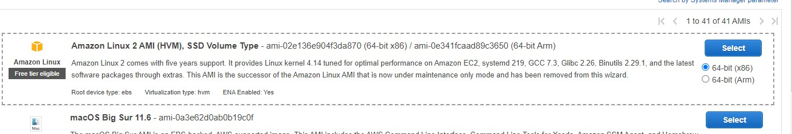
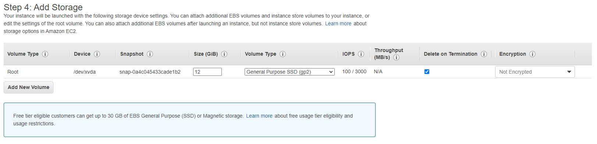
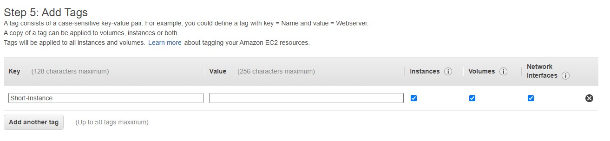

# Part 1 

1. 

2. 

3. 

4. 

5. 

# PART 2
## EC2 Instances

1.

2. I attached the VPC to the instance by using the LaunchInstanceWizard found on the VPC management Console page

3. There will be an automatically generated Public IPv4 address for the new instance. I didn't add a specific one because I don't think I need too, its just simpler that way.

4. I continued on with the LaunchInstanceWizard found on the VPC management console page and added 12gb of storage, the default amount is 8.

5. Added a tag for the instance using the LaunchInstanceWizard.

6. Associated the previously created security group to the instance.

7. Elastic IP reserved, I had to click on the instance and associate a new Elastic IP with it. I added the tag Short-EIP.

8. 

9. just type sudo hostname "name you want" I did "Short-AMI" since there isn't anything in there that I want to make a backup of I didn't. If it was something important I would have though.

10. I cannot believe it. I deleted my instance from AWS and forgot to take a snipit picture of me inside the vm. I did the write up after finishing the entire Project.