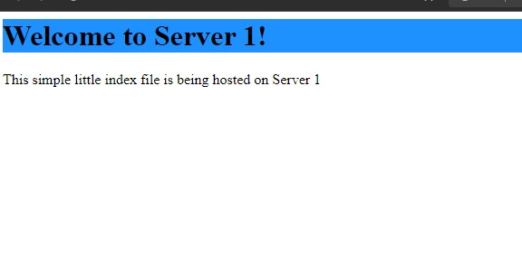

# Project 5

The .yml file includes a Main instance that installs HAProxy and two other instances.

First I had to SSH into my proxy server
I then inputed the information into a text file about my 2 web servers. ip addresses and such. "sudo nano /etc/hosts"

## Installing and Configuring HAProxy

in the CloudFormation template I installed the haproxy using "apt-get install -y haproxy &&".

I then used cd to move to my haproxy config file and used sudo to edit it.
I added the information about my web servers, the ip and port numer 80.

After the information is configured the system needed restarted. I ran "sudo systemctl restart haproxy service"

## Configure the webpages

The first step is to SSH from my haproxy instance to my other web server instances.
the webserver .html files were located in /var/www/html

After configuring and playing with them for a minute I saved my changes and exited.

